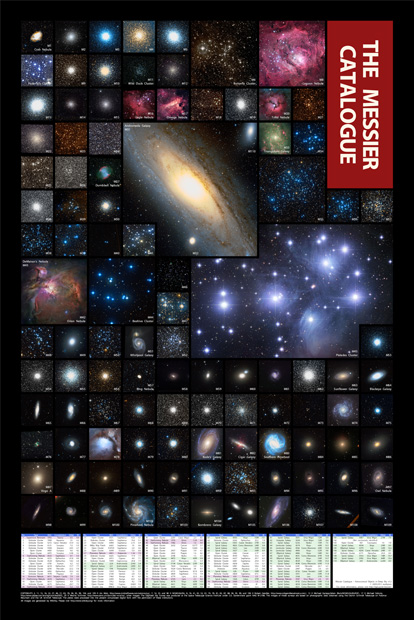

# 메시에 천체 목록 포스터
샤를 메시에는 18세기의 천문학자로 밤하늘에서 혜성을 탐색하였습니다. 메시에는 혜성과 비슷하게 보이는 성단이나 성운, 은하가 관측에 방해를 준다는 것을 알고, 이러한 천체를 혜성으로 착각하지 않도록 한둘씩 기록해 두었습니다. 이들 천체를 하나로 모아 정리해 둔 것이 메시에 목록입니다.

이 포스터는 109개의 메시에 천체를 보여줍니다. 각각의 천체는 타일 형태의 사각형 내에 표시되어 있습니다. 타일 하나의 너비는 0.5°의 시야각을 갖습니다. 모두 축척이 같아 천체의 상대적인 크기를 비교하는 데 도움이 될 것입니다. (여러 타일에 걸친 천체의 축적은 미묘하게 차이 나지만 큰 차이는 아닙니다.)

  * 포스터의 크기는 가로 560mm, 세로 840mm입니다. (비율 2:3) (참고: A1크기 594x841mm)
  * 포스터에 사용된 이미지는 저작권자의 허가 또는 사용 조건 아래 사용되었습니다.
    * COPYRIGHTS 2, 11, 15, 16, 22, 27, 46, 51, 63, 76, 94, 95, 99, 104, and 109 © Jim Misti, http://www.mistisoftware.com/astronomy/., 7, 14, 33, and 98 © NOAO/AURA., 8, 16, 41, 45, 52, 61, 74, 78, 81, 82, 87, 88, 94, 95, 99, and 106 © Robert Gendler, http://www.robgendlerastropics.com/., 12 © Michael Gariepy/Adam Block/NOAO/AURA/NSF., 17 © Michael Sidonio, http://www.pbase.com/strongmanmike2002., 20 © Mischa Schirmer, http://www.astro.uni-bonn.de/~mischa/., other images: The Digitized Sky Survey was produced at the Space Telescope Science Institute under U.S. Government grant NAG W-2166. The images of these surveys are based on photographic data obtained using the Oschin Schmidt Telescope on Palomar Mountain and the UK Schmidt Telescope. The plates were processed into the present compressed digital form with the permission of these institutions.
  * 이 포스터는 개인적/학술적인 용도로만 사용해 주세요. 상업적인 목적으로는 사용할 수 없습니다.
  * 소스 파일(messier catalogue.hml)은 한컴오피스 한글 HWPML 2.X 형식으로 작성되었습니다. 소스 파일에서 Myriad Pro 글꼴을 사용하도록 지정되었습니다만, 이 글꼴의 사용권이 없는 경우 다른 글꼴로 대체하여 사용해야합니다.
  * 주1: M102는 메시에 목록에는 포함되어 있으나 이에 해당하는 천체가 발견되지 않았습니다.

# Messier Object Catalogue Poster

TBD

# 버전
  * v1.2 – 2013년 5월 8일
    * 천체 데이터를 Wikipedia에서 참조
        * 줄간격 축소. M110의 레이블 위치 변경
        * 종이크기 변경 (560mm x 840mm, 비율을 2:3으로 구성)
  * v1.0 – 2013년 3월 26일
    * M24와 M40의 사진 및 천체 자료 추가
    * 전체적인 디자인 및 구성 수정
    * 종이크기 변경 (너비 573mm → 555mm)
  * v0.9 – 2012년 4월 28일
    * M45 플레이아데스 성단 및 M34 이미지가 M35의 것으로 잘못 지정된 것 수정
    * M45 플레이아데스 성단의 크기에 맞추어 전체 천체 재배치
    * 종이크기 변경 (너비 525mm → 573mm)
  * v0.8 – 2012년 1월 6일
    * 최초 공개
